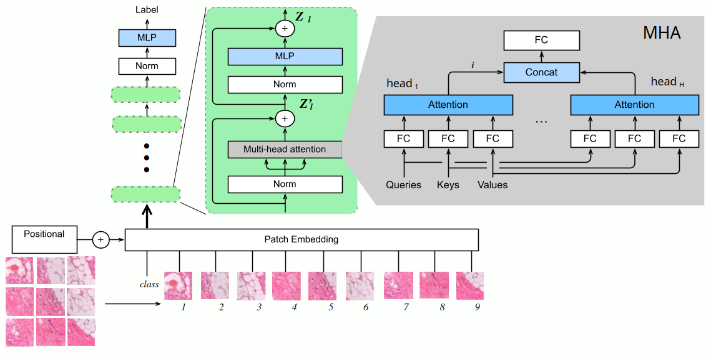

# Explainable-Histopathology-Classification-ViT
This repository proposes a ViT-based approach for histopathological image classifications that leverages ViT attention to highlight crucial image regions in the decision-making process. 

## Dataset
The dataset used for our experimental activity is publicly available at [https://gitee.com/neuhwm/GasHisSDB.git](https://gitee.com/neuhwm/GasHisSDB.git)
It contains 245,196 tissue case images of gastric cancer belonging to the Normal and Abnormal classes.


## Usage

### Installation

To install the required dependencies, use:

```bash
pip install -r requirements.txt
```

### Data Preparation
Download the dataset and unzip one of the sub-datasets in the dataset folder. 

### Fine Tuning ViT

To finetune the ViT: 

```bash
python finetune_vit.py -t [tiny,small,base]
```
This script saves the mean results in terms of Accuracy, Sensitivity, and Specificity in a YAML file in the experiments folder.  It also creates a CSV file containing the metrics per fold and saves the trained model of the first fold. 

### Attention Visualization
To visualize 50 attention visualization examples of the first fold, use:
```bash
python vis_attention.py -t [tiny,small,base]
```

This script saves the produced attention maps in a folder named attention maps.


